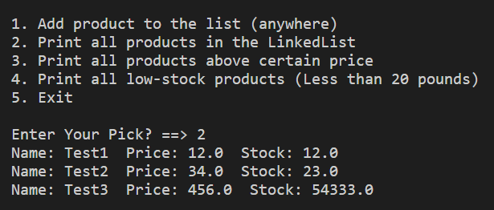

# Product Linked List

## Assignment

A greengrocer would like to maintain a linked lists about his products. For each product he saves it name, price and stock amount.
Write a program that creates an empty linked list and then prompts to user to do one of the following:

1. Add a product to the list (anywhere)
2. Print all products in the LinkedList
3. Print all products above a certain price
4. Print all low-stock products ( Less than 20 pounds)
5. Exit

Hint: The trick here is to make a node with 4 parts: one for the produce name, one for the price, one for the stock and one a ref to the next node.
```
class Node:
     def __init__(self, nm, pr, st):
         self.name = nm
         self.price = pr
         self.stock = st
         self.ref = None
```

## Example Picture




## Development

The code was developed using Python.

## Testing 

The test for this project is in `product.py`. The test will run automatically when you hit the "Run" button.
